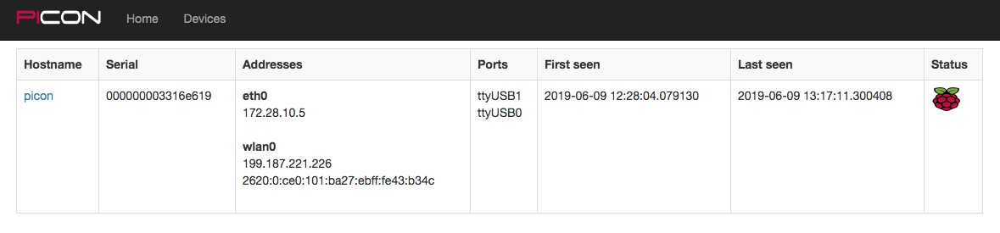

# picon
Console servers from RPis, featuring:
- Plug-and-play: ship, connect, power on and the device's agent will register with a preconfigured API
- Self-tunneling: The agent will open an SSH tunnel to a specified SSH server, with dynamic port allocation to avoid conflicts.
- (pending development) Web-based point-and-click console access via websockets
- (pending development) Daemonized agent can log all console output to syslog for forensic investigation
- (pending development) Proxy agent connects to existing console ports and registers with the API, proxying access for seamless use alongside the RPI infrastructure

Potential use cases:
- Ship to remote locations being built, with a data dongle.  Local contact would only need to unpack, plug in, and power on
- Install inside existing networks as an alternative to conventional Cisco, Digi, Avocent console infrastructure. Benefits inc
- Daemonized agent constantly logs all console output to file or syslog destinations, so that historical console output can be found for device crashes, etc
- 

picon-agent dependencies (excluding python standard library)
- Python 3+
- python3: daemonize, netifaces, pyroute2, ipaddress

Project contents:
picon/: Project top-level 

picon/server/: Python3 Flask application for the PiCon registry

picon/agent/: Python3 registry agent

picon/agent/examples/: Configuration and other example files

